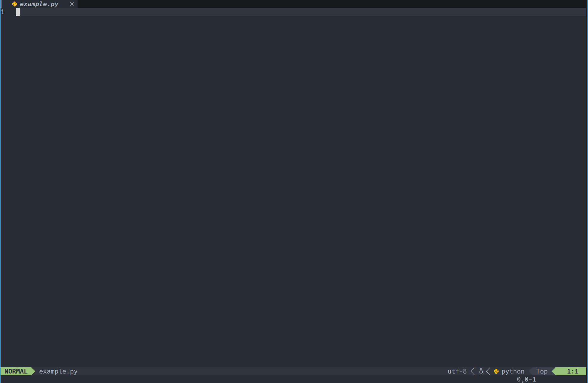
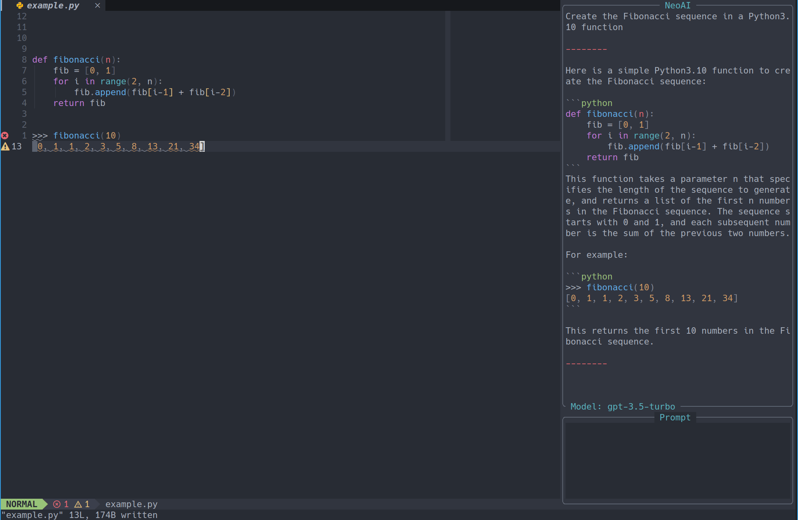
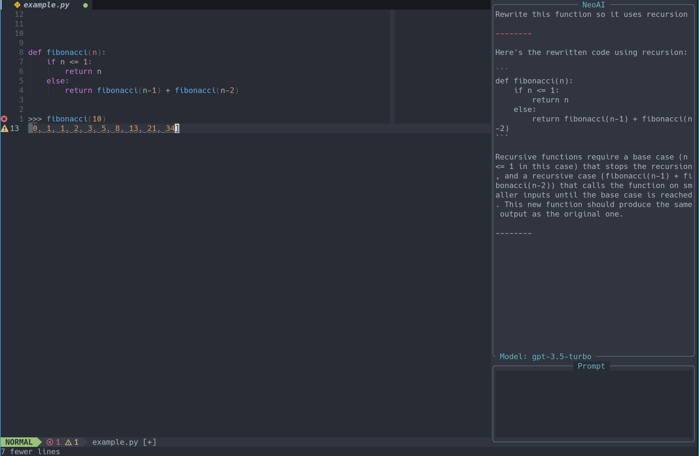
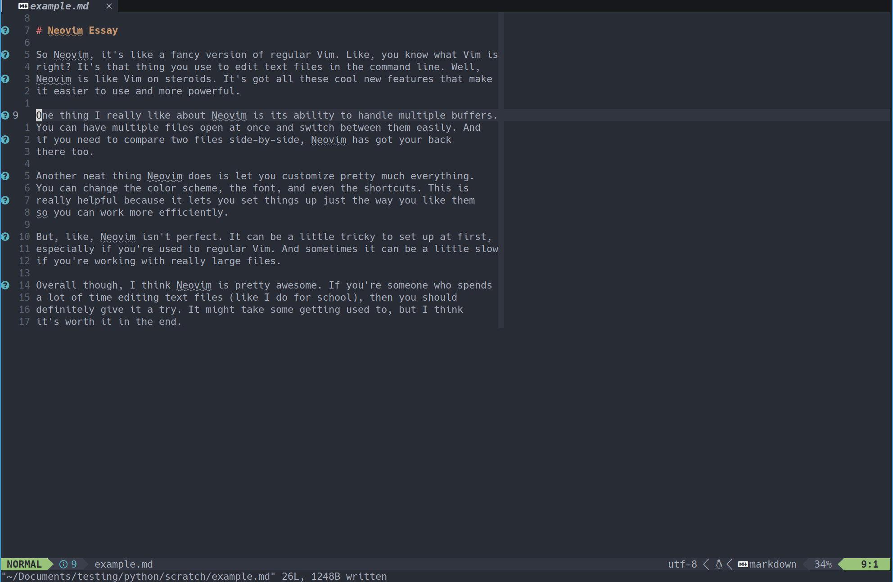
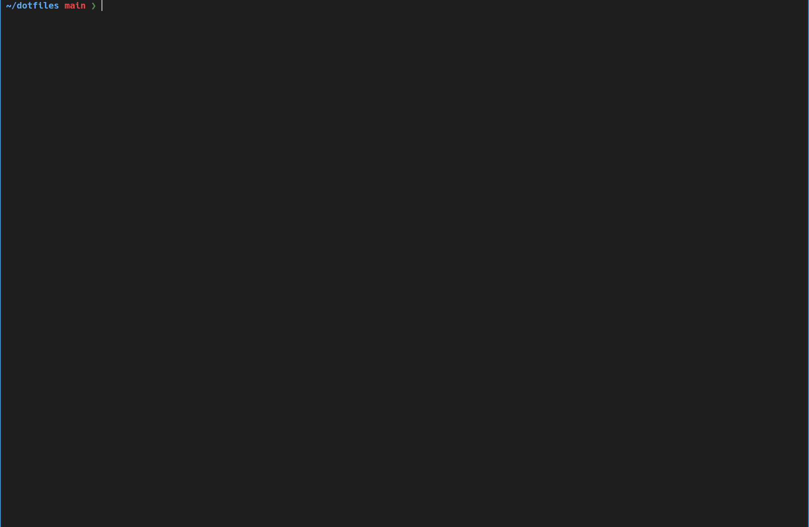

# NeoAI
NeoAI is a Neovim plugin that brings the power of OpenAI's GPT-4 directly to
your editor. It helps you generate code, rewrite text, and even get suggestions
in-context with your code. The plugin is built with a user-friendly interface,
making it easy to interact with the AI and get the assistance you need.

**Note:** This plugin is in early it's early changes and is subject to change.

## Motivation
The primary motivation behind this plugin is to provide a seamless integration of AI chat-assistants, like ChatGPT, into your Neovim coding workflow. The goal is to create a tool that works in harmony with you, allowing you to ask questions and receive assistance without disrupting your focus or coding rhythm. Unlike most existing plugins, which tend to prioritize entertainment over productivity, this plugin emphasizes efficiency and utility. By facilitating a smooth and responsive coding experience, it aims to enhance productivity and make coding more enjoyable.

## Installation
To install NeoAI, you can use your favorite plugin manager. For example,
with vim-plug, add the following line to your `init.vim` or `.vimrc`, note that
it also requires the [nui](https://github.com/MunifTanjim/nui.nvim) dependency
and curl installed on the system:

```
Plug 'MunifTanjim/nui.nvim'
Plug 'Bryley/neoai.nvim'
```
Then run `:PlugInstall` to install the plugins.

For lazy.nvim:

```lua
return {
    "Bryley/neoai.nvim",
    dependencies = {
        "MunifTanjim/nui.nvim",
    },
    cmd = {
        "NeoAI",
        "NeoAIOpen",
        "NeoAIClose",
        "NeoAIToggle",
        "NeoAIContext",
        "NeoAIContextOpen",
        "NeoAIContextClose",
        "NeoAIInject",
        "NeoAIInjectCode",
        "NeoAIInjectContext",
        "NeoAIInjectContextCode",
    },
    keys = {
        { "<leader>as", desc = "summarize text" },
        { "<leader>ag", desc = "generate git message" },
    },
    config = function()
        require("neoai").setup({
            -- Options go here
        })
    end,
}
```

For packer:

```lua
use ({
    "Bryley/neoai.nvim",
    require = { "MunifTanjim/nui.nvim" },
    cmd = {
        "NeoAI",
        "NeoAIOpen",
        "NeoAIClose",
        "NeoAIToggle",
        "NeoAIContext",
        "NeoAIContextOpen",
        "NeoAIContextClose",
        "NeoAIInject",
        "NeoAIInjectCode",
        "NeoAIInjectContext",
        "NeoAIInjectContextCode",
    },
    config = function()
        require("neoai").setup({
            -- Options go here
        })
    end,
})


```

## Showcase and Usage

To use this plugin make sure you have an OpenAI API key which can be created
[here](https://platform.openai.com/account/api-keys). Save this key in your
environment variables as `OPENAI_API_KEY`.

**IMPORTANT NOTE** : This plugin is not responsible for unintentional purchases
made to OpenAI. While using this plugin I would recommend you frequently check
the [usage](https://platform.openai.com/account/usage)
of your account and
[setup limits](https://platform.openai.com/account/billing/limits),
so you don't spend more that you can afford.

This plugin introduces 3 modes or ways to interact with the AI models.

### Normal GUI Mode

In the default mode, a GUI opens up on the side using the `:NeoAI` command,
allowing you to chat with the model. This operation is similar to what you
get when using it in a browser, but now it's made more convenient by the GUI
being inside your editor.



In the Prompt Buffer, you can send text by pressing Enter while in insert mode.
Additionally, you can insert a newline by using Control Enter. This mapping
can be changed in the config.

Also note that the plugin has a feature where the output from the model
automatically gets saved to the `g` register and all code snippets get saved to
the `c` register. These can be changed in the config.

### Context Mode

The Context mode works similarly to the Normal mode. However, you have the
ability to provide additional information about what you want to change. For
instance, if you are reading someone else's code and need a description of what
it does, you can highlight the code in the buffer via the visual mode. Then,
you can run `:NeoAIContext` and type something like "Please explain this code
for me" in the prompt buffer.



Additionally, you can highlight some text and request "Fix up the punctuation
and grammar in this text" to obtain a better version of the text.

Note that if you run the command without any selection then the whole buffer is
passed in.

### Inject Mode

The final mode is known as "inject mode" by using `:NeoAIInject`. This mode
operates without the graphical user interface, allowing you to quickly send a
prompt to the model and have the resulting output automatically inserted below
your cursor. All of this can be done without opening the GUI. Additionally,
there is a sub-mode within Inject mode that can be executed with context.




### Shortcuts

One feature of this plugin is creating shortcuts, which are explained below.
The plugin includes two built-in shortcuts; the first one reformats selected
text to improve readability, with the default key bind being `<leader>as` (A
for AI and S for summarize).



The other built-in shortcut is auto generating git commit messages for you:



**Caution**: Be aware that overusing this feature might lead to an accumulation
of data sent to the model, which can result in high costs. To avoid this, it
is recommended that smaller commits be made or the feature be used less
frequently. It is imperative to keep track of your usage, which can be
monitored through [this link](https://platform.openai.com/account/usage)


## Setup
To set up the plugin, add the following code with default values to your `init.lua` (or put
under the `config` option if using lazy.nvim or packer.nvim.

```lua
require("neoai").setup({
    -- Below are the default options, feel free to override what you would like changed
    ui = {
        output_popup_text = "NeoAI",
        input_popup_text = "Prompt",
        width = 30, -- As percentage eg. 30%
        output_popup_height = 80, -- As percentage eg. 80%
        submit = "<Enter>", -- Key binding to submit the prompt
    },
    selected_model_index = 0,
    models = {
        {
            name = "openai",
            model = "gpt-3.5-turbo",
            params = nil,
        },
        {
            name = "spark",
            model = "v1",
            params = nil,
        }
    },
    register_output = {
        ["g"] = function(output)
            return output
        end,
        ["c"] = require("neoai.utils").extract_code_snippets,
    },
    inject = {
        cutoff_width = 75,
    },
    prompts = {
        context_prompt = function(context)
            return "Hey, I'd like to provide some context for future "
                .. "messages. Here is the code/text that I want to refer "
                .. "to in our upcoming conversations:\n\n"
                .. context
        end,
    },
    mappings = {
        ["select_up"] = "<C-k>",
        ["select_down"] = "<C-j>",
    },
    open_ai = {
        api_key = {
            env = "OPENAI_API_KEY",
            value = nil,
            -- `get` is is a function that retrieves an API key, can be used to override the default method.
            -- get = function() ... end

            -- Here is some code for a function that retrieves an API key. You can use it with
            -- the Linux 'pass' application.
            -- get = function()
            --     local key = vim.fn.system("pass show openai/mytestkey")
            --     key = string.gsub(key, "\n", "")
            --     return key
            -- end,
        },
    },
    spark = {
        random_threshold = 0.5,
        max_tokens = 4096,
        version = "v1",
        api_key = {
            appid_env = "SPARK_APPID",
            secret_env = "SPARK_SECRET",
            apikey_env = "SPARK_APIKEY",
        },
    },
    shortcuts = {
        {
            name = "textify",
            key = "<leader>as",
            desc = "fix text with AI",
            use_context = true,
            prompt = [[
                Please rewrite the text to make it more readable, clear,
                concise, and fix any grammatical, punctuation, or spelling
                errors
            ]],
            modes = { "v" },
            strip_function = nil,
        },
        {
            name = "gitcommit",
            key = "<leader>ag",
            desc = "generate git commit message",
            use_context = false,
            prompt = function()
                return [[
                    Using the following git diff generate a consise and
                    clear git commit message, with a short title summary
                    that is 75 characters or less:
                ]] .. vim.fn.system("git diff --cached")
            end,
            modes = { "n" },
            strip_function = nil,
        },
    },
})
```

### Options
The setup function accepts a table of options to configure the plugin. The
available options are as follows:

### UI Options
 - `output_popup_text`: Header text shown on the output popup window (default: "NeoAI").
 - `input_popup_text`: Header text shown on the input popup window (default: "Prompt").
 - `width`: Width of the window as a percentage (e.g., 30 = 30%, default: 30).
 - `output_popup_height`: Height of the output popup as a percentage (e.g., 80 = 80%, default: 80).
 - `submit`: Key binding to submit the prompt. If set to <Enter>, <C-Enter> will be mapped to insert a newline. (default: "<Enter>").

### Model Options
 - `models`: A list of models to use:
    - `name`: The name of the model provider (eg. "openai")
    - `model`: Either a string of the model name to use or a list of model names
    - `params`: A table of parameters to pass into the model (eg. temperature, top_p)

### Register Output
 - `register_output`: A table with a register as the key and a function that takes the raw output from the AI and outputs what you want to save into that register. Example:

```lua
register_output = {
    ["g"] = function(output)
        return output
    end,
    ["c"] = require("neoai.utils").extract_code_snippets,
}
```

### Inject Options
 - `cutoff_width`: When injecting, if the text becomes longer than this value, it should go to a new line. If set to nil, the length is ignored (default: 75).

### Prompt Options
 - `context_prompt`: A function that generates the prompt to be used when using Context modes. Example:

```lua
context_prompt = function(context)
    return "Hi ChatGPT, I'd like to provide some context for future "
        .. "messages. Here is the code/text that I want to refer "
        .. "to in our upcoming conversations:\n\n"
        .. context
end
```

### OpenAI Options:
- `open_api_key_env` (deprecated, use `api_key.env` instead): The environment variable containing the OpenAI API key. The default value is "OPENAI_API_KEY ".
- `api_key.env`: The environment variable containing the OpenAI API key. The default value is "OPENAI_API_KEY".
- `api_key.value`: The OpenAI API key, which takes precedence over `api_key .env`.
- `api_key.get`: A function that retrieves the OpenAI API key. For an example implementation, refer to the [Setup](#Setup) section. It has the higher precedence.

### Spark Options:
- `random_threshold` Kernel sampling threshold. Used to determine the randomness of the outcome, the higher the value, the stronger the randomness, that is, the higher the probability of different answers to the same question
- `max_tokens` The maximum length of tokens answered by the model
- `version` The model version, `v1` or `v2`
- `api_key.appid_env` The environment variable containing the Spark appid. The default value is "SPARK_APPID".
- `api_key.secret_env` The environment variable containing the Spark secret key. The default value is "SPARK_SECRET".
- `api_key.apikey_env` The environment variable containing the Spark api key. The default value is "SPARK_APIKEY".
- `api_key.appid` App appid, obtained from an app created in the Open Platform console
- `api_key.secret` App secret key, btained from an app created in the Open Platform console
- `api_key.apikey` App api key, btained from an app created in the Open Platform console
- `api_key.get` A function that retrieves the Spark API key. For an example implementation, refer to the [Setup](#Setup) section. It has the higher precedence.


### Mappings
 - `mappings`: A table containing the following actions that can be keys:

    - `select_up`: Selects the output window when in the input window
    - `select_down`: Selects the input window when in the output window

The value is the keybinding(s) for that actions or `nil` if no action

### Shortcut Options
 - `shortcuts`: An array of shortcuts. Each shortcut is a table containing:
 - `name`: A string. The name of the shortcut, can trigger using :NeoAIShortcut <name>
 - `key`: The keybind value to listen for or nil if no keybind for the shortcut.
 - `desc` A string or nil. The description of the keybind if any
 - `use_context`: If the context from the selection/buffer should be used.
 - `prompt`: The prompt to send or a function to generate the prompt to send.
 - `modes`: A list of modes to set the keybind up for "n" for normal, "v" for visual.
 - `strip_function`: The strip function to use (optional).


## User Commands
### :NeoAI [prompt]
Smart toggles the NeoAI window. If the window is closed, it will open and send
the optional [prompt]. If the window is open and focused, it will close, finally
if the window is open but not focused, it will focus the window and send the
optional [prompt].

### :NeoAIToggle [prompt]
Toggles the NeoAI window. If the window is closed, it will open and send the
optional [prompt]. If the window is open, it will close.

### :NeoAIOpen [prompt]
Opens the NeoAI window and sends the optional [prompt].

### :NeoAIClose
Closes the NeoAI window.

### :NeoAIContext [prompt]
Smart toggles the NeoAI window with context. If the window is closed, it will
open and send the optional [prompt]. If the window is open and focused, it
will close, finally if the window is open but not focused, it will focus the
window and send the optional [prompt]. The context used for this command is the
visually selected text or the entire buffer if no selection is made.

### :NeoAIContextOpen [prompt]
Opens the NeoAI window with context and sends the optional [prompt]. The
context used for this command is the visually selected text or the entire
buffer if no selection is made.

### :NeoAIContextClose
Closes the NeoAI window with context.

### :NeoAIInject [prompt]
Sends the [prompt] to the AI and directly injects the AI response into the
buffer without opening the NeoAI window.

### :NeoAIInjectCode [prompt]
Sends the [prompt] to the AI and directly injects the AI response into the
buffer without opening the NeoAI window. The response will be stripped of
everything except code snippets.

### :NeoAIInjectContext [prompt]
Sends the [prompt] to the AI with context and directly injects the AI response
into the buffer without opening the NeoAI window. The context used for this
command is the visually selected text or the entire buffer if no selection
is made.

### :NeoAIInjectContextCode [prompt]
Sends the [prompt] to the AI with context and directly injects the AI response
into the buffer without opening the NeoAI window. The response will be stripped
of everything except code snippets. The context used for this command is the
visually selected text or the entire buffer if no selection is made.

### :NeoAIShortcut &lt;shortcut&gt;
Triggers a NeoAI shortcut that is created in the config via it's name instead of
a keybinding.


## Roadmap:

- [X] [Issue 1](https://github.com/Bryley/neoai.nvim/issues/1)
    - [X] Add description option for shortcuts
    - [X] Have ability to have shortcuts be run via user command instead
- [ ] Tests (Started)
- [ ] Multiple chat sessions
- [ ] Telescope Integration
- [ ] Switching Models
- [ ] Better Colours (eg. highlighting user input)
- [ ] Highlight context when inside NeoAIContext buffer or make context clear
- [ ] Keymap for replacing context with newly generated code
- [ ] Support for:
    - [ ] Amazon CodeWhisperer
    - [ ] Github Copilot
- [X] Better error detection
- [X] Back and forth conversations
- [X] Context using visual mode
- [X] Fix when using :q on NeoAI GUI
- [X] Config
- [X] Add custom keybinds for context related issues
- [X] Join undos of inject
- [X] Inject fix mark sometimes not set inject mode.
- [X] Inject strip output for code or other.
    - Make sure to match end of file as well and use for inject mode
- [X] Context using buffer
- [X] Strip code from output and put in buffer
- [X] Add setup config
- [X] Better way to focus on GUI window

## License
Licensed under the MIT License. Check the LICENSE file for details.
